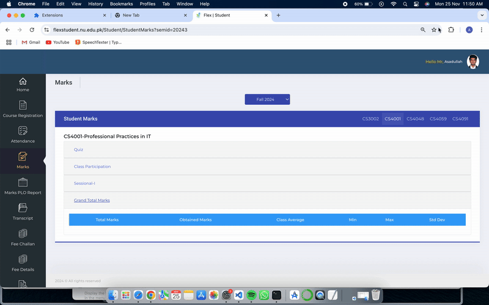
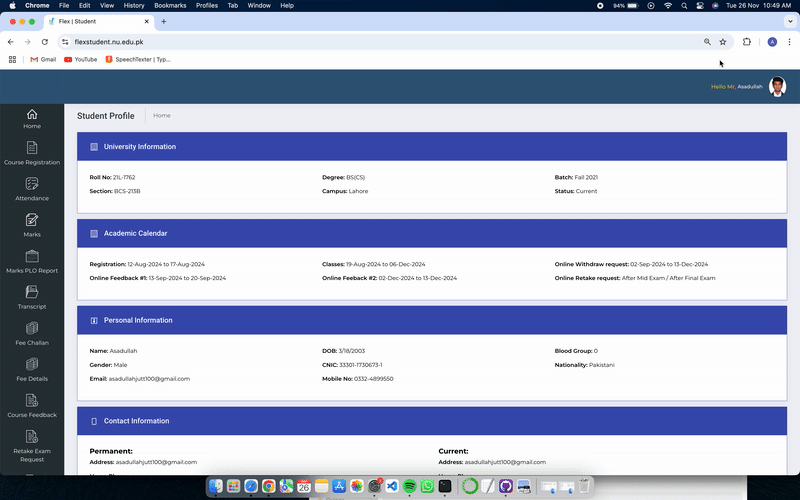

# Flex-Break

**Flex-Break** is a Chrome extension designed to make navigating the Flex Student Portal more efficient. It allows you to:
- View your Grand Total Marks with.
- Calculate SGPA for the current semester.
- Automatically update your CGPA.
- Get Admit card

### **1.Download Zip File**

### **2.Installation**
Goto > Open Google Chrome > Settings > Extensions

---

### **3.Turn-on Developer Mode**
Goto > Toggle Developer_Mode > Load_unpacked > Select (Flex-Break main)

---

### **Grand Total**
Open Marks Tab from Flex
> Tap the Extension Button > Tap Flex-Break > Tap Fix Grand Total

---

### **GPA Calculator**
Open Transcript Tab from Flex
> Tap the Extension Button > Tap Flex-Break > Tap Turn on GPA Calculator

---

### **Admit Card**
> Tap the Extension Button > Tap Flex-Break > Tap Get Admit Card

### **Disclaimer**
This Chrome extension is provided for educational and personal use only. It is intended to assist users in improving their experience with the Flex Student Portal by automating repetitive tasks such as calculating marks and selecting feedback.The author of this extension takes no responsibility for any misuse or unintended consequences of its use. Users are encouraged to ensure compliance with their institution's guidelines and policies before using the extension. Use it responsibly and at your own risk.
