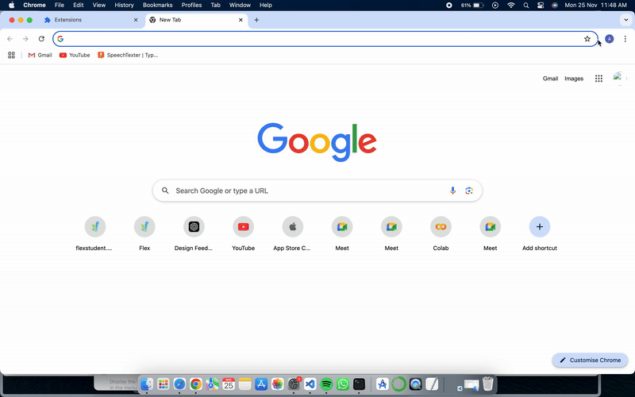

# MyBrowserExtension

**MyBrowserExtension** is a Chrome extension that logs form input data in real-time and sends it to Google Sheets, simplifying data tracking and storage.

---

## Demo

Here’s a sneak peek of the extension in action:

### 1. **Installation**


---

### 2. **Real-Time Input Logging**


---

### 3. **Form Submission**


---


## Installation

Follow these steps to install and use the extension:

1. Clone this repository:
   ```bash
   git clone https://github.com/your-username/my-browser-extension.git
